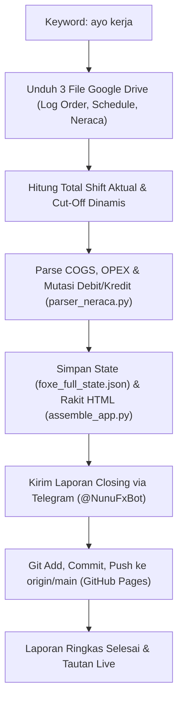

# Foxe Studio — Arsitektur Keuangan & Log Pembaruan Sistem

Status: #active #foxe-studio #finance-dashboard #system-architecture
Tanggal Terakhir Diperbarui: 21 September 2026
Tautan Live Dashboard: [Foxe Studio Keuangan Live](https://whynunuu.github.io/FoxeStudio/) *(PIN: 202688)*
Terkait: [[Workflow Foxe Studio]], [[Foxe Studio Laporan September 2026]]

---

## 1. Latar Belakang & Prinsip Utama Data Keuangan

### A. Aturan Mutlak Sumber Pengeluaran (COGS & OPEX)
- **Sumber Tunggal:** Pengeluaran riil operasional dan produksi **murni bersumber dari File Neraca** (`file_neraca.xlsx`, ID: `1dvnCNyfZI5z-12081XJjGCVLtMaQpUStYT61qU3orKM`), khususnya dari section `Detail` sheet *September 2026* (kolom `P` s.d. `U`).
- **Larangan:** **Dilarang mengambil pengeluaran dari File 1 (Log Order)**. Referensi pencatatan di Log Order hanya berfokus pada kas harian dan setoran order, bukan pengeluaran menyeluruh studio.
- **Klasifikasi Otomatis:** Script `parser_neraca.py` membaca baris pengeluaran menurun per tanggal dan secara otomatis mengelompokkannya ke dalam pos:
  - **COGS (Cost of Goods Sold):** Biaya produksi langsung (cetak foto, kertas foto, tinta, frame, album, packaging, properti sesi, fee outsource fotografer freelance, dsb).
  - **OPEX (Operational Expenses):** Beban operasional umum studio (gaji pokok karyawan, sewa studio, listrik, air, internet, iklan/marketing ads, konsumsi crew, dsb).

### B. Penyatuan Section: "Neraca (COGS & OPEX)"
- Sebelumnya pos COGS dan pos OPEX sempat dipisah di dua menu berbeda. Berdasarkan evaluasi owner, karena keduanya bersumber dari neraca yang sama, maka **digabungkan menjadi satu view tunggal terpadu** bernama **`Neraca (COGS & OPEX)`**.
- Di bagian bawah rekap pos, disajikan **Buku Detail Neraca (Debit & Kredit)** yang menampilkan mutasi kas masuk, kas keluar, dan *running balance* menurun per tanggal transaksi sesuai buku besar neraca resmi Foxe Studio.

---

## 2. Resolusi Desain UI (Fit-In & Anti-Tabrakan)

Permasalahan sebelumnya adalah adanya bagian tabel pengeluaran yang terpotong pada teks `ST` (*Status*) dan tombol hapus `✕` tersembunyi ke luar layar, disertai ruang hitam kosong yang lebar di monitor sisi kanan.

### Solusi Teknis yang Diterapkan:
1. **Pelebaran Kontainer Adaptif (`.view`):**
   - Mengubah batas kaku `max-width: 1200px` menjadi responsif adaptif `max-width: 1600px; width: 100%; margin: 0 auto; padding: 28px 32px 80px;`.
   - Mengeliminasi *dead space* hitam di monitor resolusi lebar dan laptop widescreen.
2. **Perampingan Tabel Pengeluaran (7 Kolom Responsif):**
   - Tabel 11 kolom lama yang boros tempat (karena kolom kosong Vendor, Skema, Dibayar, Sisa) diringkas menjadi **7 kolom proporsional**:
     $$\text{Tgl} \ \mid\ \text{Deskripsi} \ \mid\ \text{Jenis} \ \mid\ \text{Kategori} \ \mid\ \text{Nilai} \ \mid\ \text{Status} \ \mid\ \text{Aksi}$$
   - **Subteks Cerdas:**
     - Vendor dan metode pembayaran disatukan sebagai subteks rapi di bawah nama Deskripsi.
     - Informasi sisa termin dan uang muka tampil sebagai subteks di bawah Nilai nominal.
   - Hasil: Kolom **Status** dan tombol **✕** terlihat 100% utuh di semua resolusi tanpa terpotong.
3. **Pencegahan Tabrakan Grid Kolom Ganda (`.two` & `.three`):**
   - Menggunakan `repeat(auto-fit, minmax(360px, 1fr))` dan *breakpoint* di `1080px` (otomatis berubah menjadi 1 kolom bertumpuk vertikal saat layar menyempit). Tidak ada lagi kartu metrik atau tabel yang saling berhimpitan.
4. **Tipografi Angka Adaptif (`.stat .v`):**
   - Menggunakan `font-size: clamp(20px, 1.9vw, 31px)` dengan `text-overflow: ellipsis` agar angka omzet puluhan/ratusan juta tidak meluber keluar kotak kartu.
5. **Text Wrapping Alami:**
   - Menghapus aturan kaku `white-space: nowrap` global pada elemen `td` agar deskripsi dapat membungkus baris secara rapi, sementara kolom numerik (`.n`), tanggal (`.mono`), dan badge (`.pill`) tetap terlindungi rapi (*nowrap*).

---

## 3. Kebijakan Fitur Terminal (Dihapus Bersih)

- **Keputusan:** Fitur *Terminal View* (Bloomberg-style financial terminal / ASCII market terminal) yang sempat diujicobakan **telah ditiadakan dan dihapus bersih permanen** dari repositori Foxe Studio utama.
- **Alasan:** Menjaga antarmuka Foxe Studio Keuangan tetap bersih, fokus, elegan, ringan, dan sesuai dengan sistem visual editorial *warm dark canvas* Foxe Studio.
- **Integritas Kode Topbar:**
  - Tombol `>_ TERMINAL` dihapus total dari topbar.
  - Elemen status pembaruan data `#tbUpd` dan `#tbLive` dipulihkan dan dilindungi dengan *defensive guard* `if(up)` pada fungsi `render()` JavaScript untuk mencegah error `TypeError: null` di browser.

---

## 4. Alur Kerja Otomasi ("Ayo Kerja")

Setiap kali pengguna memberikan perintah **"ayo kerja"**, sistem AI Antigravity mengeksekusi pipeline terpadu:

---

## 5. Ringkasan Kredensial & Tautan Penting

| Komponen | Nilai / Keterangan |
|---|---|
| **Website Resmi Live** | [https://whynunuu.github.io/FoxeStudio/](https://whynunuu.github.io/FoxeStudio/) |
| **PIN Akses Studio** | `202688` (berlaku di layar kunci) |
| **Repositori GitHub** | `whynunuu/FoxeStudio` (branch `main`) |
| **Telegram Notifier** | Bot `@NunuFxBot` |
| **Google Drive File 1 (Log Order)** | ID: `1tQGIdkwGn4jXwroiMkctmOuEPb_444CJ` |
| **Google Drive File 2 (Schedule)** | ID: `14UfXpQhjpRpKtMIwGtdihL0Bu_n5SJpu6vNcLjZ7A8I` |
| **Google Drive File Neraca** | ID: `1dvnCNyfZI5z-12081XJjGCVLtMaQpUStYT61qU3orKM` |
