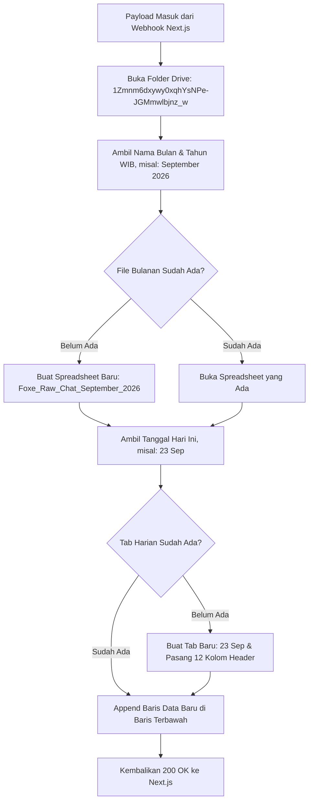

# Foxe Studio — Google Drive Monthly Sheet Sync

Status: #active #foxe-studio #google-drive #google-apps-script #backup
Tanggal Terakhir Diperbarui: 23 September 2026
Terkait: [[Foxe Studio - AI CRM & Automation Memory]], [[Foxe Studio - Parser Specs & Data Pipeline]]

---

## 1. Latar Belakang & Kebutuhan Bisnis

Selain menyimpan data pelanggan di database Neon PostgreSQL, Foxe Studio membutuhkan salinan fisik yang mudah diakses oleh pemilik (*owner*) tanpa perlu membuka database terminal atau console SQL.

Pemilik studio ingin dapat membuka folder Google Drive di HP kapan pun, melihat spreadsheet bulan berjalan, dan membaca rekapitulasi chat per hari secara terstruktur tanpa lembar kerja (*sheet*) menjadi lambat atau terlalu panjang.

---

## 2. Parameter Integrasi Cloud

| Parameter | Nilai Konfigurasi |
| :--- | :--- |
| **Google Drive Folder ID** | `1Zmnm6dxywy0xqhYsNPe-JGMmwlbjnz_w` |
| **Google Apps Script Webhook URL** | `https://script.google.com/macros/s/AKfycbzholPN4efU3CWU1qmSwTA0S6T1Ld_fERyBGpYj3Yqmc4n8M16VaEKjBSGDkXAA7tCsyw/exec` |
| **Metode HTTP** | `POST` (Body: JSON) |
| **Variabel Lingkungan** | `GOOGLE_SHEETS_WEBHOOK_URL` di Vercel |

---

## 3. Logika Partisi Otomatis (Bulan & Hari)

Google Apps Script diprogram dengan logika partisi cerdas:



### Aturan Penamaan File & Tab:
1. **Nama File Spreadsheet (Bulanan):**
   `Foxe_Raw_Chat_[NamaBulan]_[Tahun]` (contoh: `Foxe_Raw_Chat_September_2026`, `Foxe_Raw_Chat_Oktober_2026`).
2. **Nama Tab Lembar Kerja (Harian):**
   `[Tanggal] [Bulan]` (contoh: `23 Sep`, `24 Sep`). Setiap hari baru otomatis memiliki tab terpisah.

---

## 4. Struktur 12 Kolom Lembar Kerja

Saat tab harian pertama kali dibuat oleh script, baris pertama (Row 1) diformat dengan *styling* header gelap dan teks putih:

| No | Nama Kolom | Contoh Isi Data | Keterangan |
| :---: | :--- | :--- | :--- |
| 1 | `Waktu (WIB)` | `23/09/2026 13:45:10` | Waktu lokal Indonesia barat |
| 2 | `Nomor WhatsApp` | `628123456789` | Standar internasional tanpa tanda baca |
| 3 | `Nama Pelanggan` | `Siti Rahma` | Nama kontak atau nama rekening struk |
| 4 | `Status Lead` | `BOOKING` | `NEW`, `CONTACTED`, `BOOKING`, `LOST` |
| 5 | `Kategori Niat` | `BOOKING` | `TANYA_PRODUK`, `PRICELIST`, `KOMPLAIN` |
| 6 | `Suhu & Skor` | `HOT (100)` | Klasifikasi suhu prospek |
| 7 | `Admin Bertugas` | `Admin 1` | Staf CS pemegang shift saat chat masuk |
| 8 | `Isi Pesan Masuk` | `Berikut bukti transfer DP 200rb...` | Pesan teks asli dari WhatsApp |
| 9 | `Ringkasan AI` | `[STRUK SAH] Transfer BCA Rp 200.000` | Hasil audit 1 kalimat dari Gemini |
| 10 | `Draf Balasan CS`| `Halo Kak! Pembayaran transfer sudah...` | Saran balasan resmi dari AI |
| 11 | `Tindakan Operasional` | `Verifikasi mutasi kas & amankan slot` | Saran aksi internal staf |
| 12 | `Status Follow-Up` | `COMPLETED` | `PENDING`, `COMPLETED`, `NOT_NEEDED` |

---

## 5. Script Deployment Google Apps Script (Referensi Kode)

Kode script yang terpasang pada Apps Script Webhook:

```javascript
function doPost(e) {
  try {
    var data = JSON.parse(e.postData.contents);
    var targetFolderId = "1Zmnm6dxywy0xqhYsNPe-JGMmwlbjnz_w";
    var folder = DriveApp.getFolderById(targetFolderId);

    var now = new Date();
    // Konversi ke zona waktu Asia/Jakarta (WIB)
    var timeZone = "Asia/Jakarta";
    var monthNames = ["Januari", "Februari", "Maret", "April", "Mei", "Juni", 
                      "Juli", "Agustus", "September", "Oktober", "November", "Desember"];
    var shortMonths = ["Jan", "Feb", "Mar", "Apr", "Mei", "Jun", "Jul", "Ags", "Sep", "Okt", "Nov", "Des"];
    
    var monthStr = monthNames[now.getMonth()];
    var yearStr = now.getFullYear();
    var dayStr = Utilities.formatDate(now, timeZone, "dd") + " " + shortMonths[now.getMonth()];
    var timestampStr = Utilities.formatDate(now, timeZone, "dd/MM/yyyy HH:mm:ss");

    var fileName = "Foxe_Raw_Chat_" + monthStr + "_" + yearStr;
    var files = folder.getFilesByName(fileName);
    var spreadsheet;

    if (files.hasNext()) {
      spreadsheet = SpreadsheetApp.open(files.next());
    } else {
      spreadsheet = SpreadsheetApp.create(fileName);
      var file = DriveApp.getFileById(spreadsheet.getId());
      folder.addFile(file);
      DriveApp.getRootFolder().removeFile(file);
    }

    var sheet = spreadsheet.getSheetByName(dayStr);
    if (!sheet) {
      sheet = spreadsheet.insertSheet(dayStr);
      // Buat Header 12 Kolom
      var headers = [
        "Waktu (WIB)", "Nomor WhatsApp", "Nama Pelanggan", "Status Lead",
        "Kategori Niat", "Suhu & Skor", "Admin Bertugas", "Isi Pesan Masuk",
        "Ringkasan AI", "Draf Balasan CS", "Tindakan Operasional", "Status Follow-Up"
      ];
      sheet.appendRow(headers);
      sheet.getRange(1, 1, 1, 12).setBackground("#1e293b").setFontColor("#ffffff").setFontWeight("bold");
      sheet.setFrozenRows(1);
    }

    var row = [
      timestampStr,
      data.phoneNumber || "-",
      data.name || "-",
      data.status || "NEW",
      data.intentCategory || "INFO_UMUM",
      (data.temperature || "COLD") + " (" + (data.leadScore || 0) + ")",
      data.handledByAdmin || "Admin 1",
      data.messageText || "-",
      data.summary || "-",
      data.recommendedReply || "-",
      data.suggestedAction || "-",
      data.needsFollowUp ? "PENDING" : "COMPLETED"
    ];

    sheet.appendRow(row);
    return ContentService.createTextOutput(JSON.stringify({ status: "success" }))
      .setMimeType(ContentService.MimeType.JSON);
  } catch (err) {
    return ContentService.createTextOutput(JSON.stringify({ status: "error", message: err.toString() }))
      .setMimeType(ContentService.MimeType.JSON);
  }
}
```

---

## 6. Sifat Non-Blocking (Ketahanan Next.js)

Pemanggilan sync ini di `src/lib/services/sheets-sync.ts` dirancang bersifat **asinkronus dan non-blocking**:
- Jika Google Drive mengalami kelambatan respon (*latency spike* > 5 detik), sistem WhatsApp Webhook Next.js tetap mengembalikan status `200 OK` ke WhatsApp Gateway Fonnte.
- Hal ini mencegah terjadinya *retry loop* dari WhatsApp Gateway yang dapat menyebabkan pesan duplikat.
