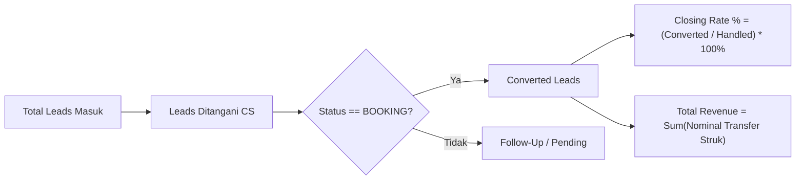

# Foxe Studio — KPI & Conversion Tracking System

Status: #active #foxe-studio #kpi #conversion-rate #customer-service
Tanggal Terakhir Diperbarui: 23 September 2026
Tautan Live Dashboard: [Dashboard Bisnis & KPI](https://foxe-studio-id.vercel.app/dashboard)
Terkait: [[Foxe Studio - AI CRM & Automation Memory]], [[Foxe Studio - WhatsApp Webhook & Shift System]], [[Foxe Studio - Vision AI Receipt OCR]]

---

## 1. Latar Belakang & Tujuan Metrik Bisnis

Untuk memotivasi staf Customer Service (CS) yang bertugas dalam shift serta memberikan evaluasi bonus bulanan yang adil dan objektif (*countable*), Foxe Studio menerapkan **Sistem KPI Konversi Otomatis**.

Sistem ini memecahkan dua masalah krusial:
1. **Pencatatan Konversi Subjektif:** Dahulu, konversi dicatat manual sehingga rentan terjadi klaim sepihak antar staf.
2. **Ketiadaan Reminder Tindakan Cepat:** Prospek yang baru mengirim uang muka sering terlambat dikonfirmasi karena CS lupa memeriksa mutasi.

---

## 2. Metrik Kunci Evaluasi CS (Countable Formulas)

Setiap akhir bulan, pemilik studio dapat mengaudit kinerja CS berdasarkan formula matematis transparan:



### Formulasi KPI:

1. **Jumlah Prospek Ditangani ($N_{handled}$):**
   Total percakapan unik pelanggan yang masuk dan ditugaskan ke Admin 1 atau Admin 2 berdasarkan jam shift atau tanda tangan hashtag.

2. **Jumlah Konversi Berhasil ($N_{converted}$):**
   Jumlah pelanggan unik yang statusnya berhasil ditingkatkan menjadi **`BOOKING`** (baik melalui verifikasi struk transfer Vision AI maupun konfirmasi manual kasir/CS).

3. **Tingkat Keberhasilan Penutupan (Closing Rate $\%$):**
   $$\text{Closing Rate} = \left( \frac{N_{converted}}{N_{handled}} \right) \times 100\%$$

4. **Kontribusi Omzet Shift ($R_{shift}$):**
   Akumulasi nominal rupiah dari seluruh bukti transfer sah yang diselesaikan oleh admin tersebut:
   $$R_{shift} = \sum_{i=1}^{N_{converted}} \text{Nominal Transfer}_i$$

---

## 3. Normalisasi Staf ke Admin 1 & Admin 2

Pada endpoint `/api/reports/stats`, data leads secara dinamis dinormalisasi ke dalam dua slot shift kerja:

```typescript
// src/app/api/reports/stats/route.ts
const admin1Key = "Admin 1 (Shift 09:00 - 15:00)";
const admin2Key = "Admin 2 (Shift 15:00 - 21:00)";

allLeads.forEach((lead) => {
  const rawAdmin = lead.closingAdmin || lead.leadOwner || lead.interactions[0]?.handledByAdmin || "";
  const isShift2 = rawAdmin.includes("2") || rawAdmin.toLowerCase().includes("indah");
  const targetKey = isShift2 ? admin2Key : admin1Key;

  const existing = csPerformanceMap.get(targetKey)!;
  existing.handledLeads += 1;
  if (lead.status === "BOOKING" || lead.hasBooking) {
    existing.convertedLeads += 1;
    existing.totalRevenue += lead.revenue || 0;
  }
  existing.conversionRate =
    existing.handledLeads > 0
      ? Math.round((existing.convertedLeads / existing.handledLeads) * 100)
      : 0;
});
```

### Tampilan Tabel di `/dashboard`:
| Staf CS & Jam Shift | Prospek Ditangani | Closing Booking | Closing Rate | Kontribusi Omzet | Status Evaluasi |
| :--- | :---: | :---: | :---: | :---: | :---: |
| **Admin 1 (09:00 - 15:00)** | 24 Leads | 8 Booking | **33%** | Rp 2.450.000 | Siaga Aktif |
| **Admin 2 (15:00 - 21:00)** | 19 Leads | 7 Booking | **37%** | Rp 2.100.000 | Siaga Aktif |

---

## 4. Kotak Pengingat Tindakan CS (Action Required Reminder Box)

Terletak di posisi teratas halaman `/dashboard` sebagai widget prioritas (*Executive Action Area*):

```
┌────────────────────────────────────────────────────────────────────────┐
│ 🔔 REMINDER TINDAKAN CS & KONFIRMASI BOOKING (ACTION REQUIRED)          │
│ 3 prospek baru mengirim bukti transfer atau butuh tindakan segera!      │
├────────────────────────────────────────────────────────────────────────┤
│ [HOT 🔥] Siti Rahma (08123456789)                                       │
│ 🏦 BCA Rp 200.000 (Ref: 202609230918) | Admin: Admin 1                 │
│ 📝 Draf: "Halo Kak! Pembayaran transfer 200rb via BCA sudah kami..."    │
│ [🟢 Kirim WA (Human)]   [Lihat di CRM]                                 │
└────────────────────────────────────────────────────────────────────────┘
```

### Fitur Reminder Box:
1. **Highlight Transaksi Berhasil:** Menampilkan daftar 5 leads teratas yang baru mengirim bukti pembayaran atau memiliki sentimen urgensi tinggi.
2. **Badge Nominal Omzet:** Menampilkan nominal rupiah transfer yang terdeteksi AI secara mencolok dengan badge hijau.
3. **Tombol "Kirim WA (Human)":** Mengarahkan CS langsung ke `https://wa.me/[nomor]?text=[encoded_draf]` sehingga CS dapat mengirimkan konfirmasi hanya dalam satu sentuhan tanpa mengetik ulang.
4. **Attribution Badge:** Menandai siapa admin yang sedang bertanggung jawab atas prospek tersebut.

---

## 5. Manfaat untuk Pemilik Studio (Owner Value)

1. **Transparansi Bonus Kinerja:** Owner dapat memberikan bonus insentif bulanan kepada mahasiswa CS yang memiliki Closing Rate tertinggi atau membawa omzet terbanyak secara adil.
2. **Pencegahan Prospek Terbengkalai:** Menghilangkan risiko chat prospek terlewat (*unattended leads*) saat pergantian shift dari siang ke sore.
3. **Penyelarasan Data Otomatis:** Omzet yang tercatat di CRM langsung terkoneksi dengan kasir POS dan rekonsiliasi kas di neraca.
