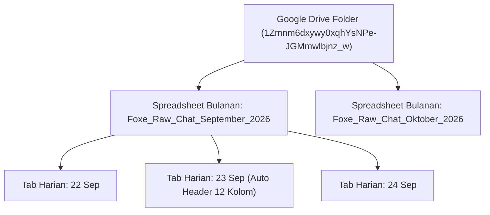

# Foxe Studio — Parser Specs & Data Pipeline

Status: #active #foxe-studio #parsers #technical-spec
Tanggal Terakhir Diperbarui: 23 September 2026
Terkait: [[Foxe Studio - AI CRM & Automation Memory]], [[Foxe Studio - Vision AI Receipt OCR]], [[Foxe Studio - WhatsApp Webhook & Shift System]], [[Foxe Studio - Google Drive Monthly Sheet Sync]]

---

## 1. Ikhtisar Arsitektur Parser

Platform Foxe Studio memiliki **4 Parser Utama** yang bekerja secara sekuensial untuk mengekstrak, memvalidasi, menormalkan, dan menyinkronkan data dari berbagai sumber:

```
[Inbound Data Stream]
   │
   ├── [Parser 1: Inbound Webhook Payload Adapter] ──► Normalisasi format Fonnte / WAHA / Simulator
   │
   ├── [Parser 2: Gemini Multimodal Vision AI OCR] ──► Ekstraksi teks & nominal dari foto struk transfer
   │
   ├── [Parser 3: Lead Intent & Rule Signals Parser] ──► Scoring regex 06_LEAD_SCORING & JSON Schema AI
   │
   └── [Parser 4: Google Drive & Sheets Partitioner] ──► Pemetaan kolom, pembuatan file bulanan & tab harian
```

---

## 2. Parser 1: Inbound Webhook Payload Adapter

- **File Sumber:** `src/app/api/webhook/whatsapp/route.ts`
- **Fungsi:** `extractMessagePayload(body: Record<string, unknown>): ExtractedPayload`
- **Tujuan:** Mengharmonisasi perbedaan struktur JSON kiriman dari berbagai WhatsApp Gateway (Fonnte, WAHA, Meta Cloud API, atau Local Simulator).

### A. Struktur Tipe Data Output
```typescript
interface ExtractedPayload {
  senderNumber: string;    // Nomor telepon internasional Indonesia (contoh: "628123456789")
  messageText: string;     // Teks pesan chat atau fallback "[Bukti Pembayaran / Foto Media]"
  senderName?: string;     // Nama profil WhatsApp klien (jika tersedia)
  mediaUrl?: string;       // URL file gambar (jika gateway mengirim via CDN URL)
  imageBase64?: string;    // String representasi Base64 gambar struk
}
```

### B. Aturan Adaptasi Payload (Multi-Format Support)

1. **Format 1 — Fonnte Gateway:**
   ```json
   {
     "sender": "6285189210021",
     "message": "Halo kak mau booking paket graduation",
     "name": "Budi Santoso",
     "url": "https://media.fonnte.com/images/..."
   }
   ```
   - Mendeteksi atribut `sender`, `message`, `name`, dan `url`.

2. **Format 2 — WAHA (WhatsApp HTTP API):**
   ```json
   {
     "event": "message",
     "payload": {
       "from": "628123456789@c.us",
       "body": "Berikut bukti transfernya ya kak",
       "pushname": "Siti Rahma",
       "media": { "url": "https://waha-host/media/..." },
       "_data": { "notifyName": "Siti" }
     }
   }
   ```
   - Menghapus suffix `@c.us` dan `@s.whatsapp.net` pada nomor pengirim.
   - Mengambil URL media dari `payload.media.url` atau fallback `payload.url`.

3. **Format 3 — Simulator & Generic Payload:**
   - Mendeteksi variasi penamaan kunci seperti `phoneNumber`, `phone`, `from`, `messageText`, `text`, `mediaUrl`, `image`, atau `file`.

### C. Normalisasi Nomor Telepon (`normalizePhoneNumber`)
```typescript
function normalizePhoneNumber(phone: string): string {
  let clean = phone.replace(/[^0-9]/g, "");
  if (clean.startsWith("08")) {
    clean = "628" + clean.slice(2);
  }
  return clean;
}
```
- Menghapus spasi, strip, tanda tambah (+), dan tanda kurung.
- Mengubah awalan lokal `08...` menjadi standar internasional `628...`.

---

## 3. Parser 2: Vision AI Multimodal OCR Receipt Parser

- **File Sumber:** `src/lib/ai/receipt-analyzer.ts`
- **Fungsi:** `analyzePaymentReceipt(params): Promise<PaymentReceiptResult | null>`
- **Model:** `gemini-3.5-flash-lite` dengan instruksi multimodal.
- **Tujuan:** Memvalidasi foto tangkapan layar bukti transfer m-Banking, ATM, atau QRIS secara deterministik menggunakan *Strict Structured JSON Schema*.

### A. Input Parameter
```typescript
params: {
  imageUrl?: string;        // URL publik foto struk
  imageBase64?: string;     // Base64 buffer foto struk
  mimeType?: string;        // Default: "image/jpeg"
  captionText?: string;     // Keterangan chat yang menyertai gambar
  clientName?: string;      // Nama pengirim pada database kontak
}
```

### B. Skema Output Terstruktur (Strict JSON Schema)
```typescript
interface PaymentReceiptResult {
  isPaymentReceipt: boolean;           // True jika bukti transfer sah
  bankName: string;                    // "BCA", "Mandiri", "BRI", "QRIS", dll.
  amount: number;                      // Nominal bulat rupiah (integer, misal: 200000)
  senderName: string;                  // Nama pemilik rekening pengirim
  recipientName: string;               // Rekening tujuan (Foxe Studio)
  transactionDate: string;             // Tanggal/waktu transaksi tertera
  isSuccess: boolean;                  // True jika status "Berhasil" / "Sukses"
  referenceNumber: string;             // Nomor referensi / ID transaksi
  summary: string;                     // 1 kalimat audit hasil verifikasi
  confidenceScore: number;             // Skor keyakinan 0.0 - 1.0
  suggestedConfirmationReply: string;  // Draf konfirmasi resmi untuk CS
}
```

> [!IMPORTANT]
> **Defensive Handling:** Jika gambar yang dikirimkan adalah foto selfie, pemandangan, atau katalog bukan bukti transfer, parser secara tegas mengembalikan `isPaymentReceipt = false`, `amount = 0`, dan `isSuccess = false`.

---

## 4. Parser 3: Lead Intent & Rule Signals Parser

- **File Sumber:** `src/lib/ai/lead-analyzer.ts`
- **Fungsi:** `extractRuleSignals(text: string)` & `analyzeLeadMessage(input)`
- **Tujuan:** Mendeteksi niat pembelian (*Purchase Intent*) berdasarkan aturan modular `06_LEAD_SCORING` dan kecerdasan linguistik Google Gemini.

### A. Sinyal Rule-Based (Regex Engine)
Dimulai dari baseline score 10 poin:

| Sinyal | Pola Ekspresi Reguler (Regex) | Bobot Poin | Flag Tambahan |
| :--- | :--- | :---: | :--- |
| `ASK_PRICE` | `/harga\|biaya\|tarif\|pricelist\|berapa/` | +15 | - |
| `ASK_PACKAGE` | `/paket\|photofox\|wisuda\|graduation\|couple\|family\|group\|pas foto\|self photo/` | +15 | - |
| `ASK_DATE` | `/tanggal\|hari\|sabtu\|minggu\|besok\|lusa\|jadwal\|slot\|jam\|tgl/` | +20 | - |
| `ASK_AVAILABILITY`| `/bisa\|ready\|kosong\|tersedia\|ada slot\|bisa booking\|masih ada/` | +20 | - |
| `MENTION_GROUP_SIZE`| `/orang\|pax\|rombongan\|keluarga\|teman\|berdua\|grup/` | +15 | - |
| `ASK_DP` | `/dp\|down payment\|tanda jadi\|panjar/` | +30 | `isNearBooking = true` |
| `ASK_BANK_ACCOUNT`| `/rekening\|transfer\|bca\|mandiri\|qris\|bayar\|tf/` | +30 | `isNearBooking = true` |

### B. Klasifikasi Suhu Prospek (Temperature Classifier)
$$\text{Final Score} = \min(100, \text{RuleScore})$$
- **HOT 🔥 (Skor 66 – 100):** Menanyakan nomor rekening, DP, booking hari tertentu, atau mengirimkan konfirmasi transfer.
- **WARM 🟡 (Skor 31 – 65):** Menanyakan ketersediaan slot hari, paket harga, atau membawa rombongan.
- **COLD ❄️ (Skor 0 – 30):** Sekadar menyapa ("P", "halo kak"), tanya lokasi umum tanpa tanggal sesi.

### C. 2-Tier AI Engine Execution Flow
1. **Tier 1 (Lightweight & Rapid):** Menggunakan `gemini-3.5-flash-lite` dengan latensi ~1-2 detik. Menghasilkan klasifikasi intent (`TANYA_PRODUK`, `BOOKING`, `KOMPLAIN`, `PRICELIST`, `INFO_UMUM`) dan draf balasan ramah.
2. **Tier 2 (Deep Reasoning Escalation):** Otomatis dipicu jika intent adalah `KOMPLAIN` atau pesan bernada negatif/urgensi tinggi ($\ge 4/5$).

---

## 5. Parser 4: Google Drive & Sheets Partitioner

- **File Sumber:** `src/lib/services/sheets-sync.ts` & Google Apps Script
- **Endpoint Webhook:** `https://script.google.com/macros/s/AKfycbzholPN4efU3CWU1qmSwTA0S6T1Ld_fERyBGpYj3Yqmc4n8M16VaEKjBSGDkXAA7tCsyw/exec`
- **Google Drive Folder ID:** `1Zmnm6dxywy0xqhYsNPe-JGMmwlbjnz_w`
- **Tujuan:** Partisi otomatis spreadsheet berdasarkan nama bulan dan tab harian agar pencatatan chat rapi dan tidak pernah menumpuk dalam 1 sheet raksasa.

### A. Format JSON Payload Sinkronisasi
```json
{
  "phoneNumber": "628123456789",
  "name": "Budi Santoso",
  "status": "BOOKING",
  "intentCategory": "BOOKING",
  "sentiment": "POSITIF",
  "urgencyScore": 5,
  "leadScore": 100,
  "temperature": "HOT",
  "ruleSignals": "PAYMENT_RECEIPT_VERIFIED, BCA",
  "summary": "[PEMBAYARAN SAH] Rp 200.000 via BCA. Ref: 892183912",
  "recommendedReply": "Halo Kak! Pembayaran transfer sebesar Rp 200.000 via BCA sudah kami terima...",
  "suggestedAction": "Verifikasi mutasi rekening & kirim jadwal sesi foto",
  "messageText": "Berikut bukti transfernya ya kak [Foto Bukti Transfer Terlampir]",
  "needsFollowUp": false,
  "isHighPriority": true,
  "handledByAdmin": "Admin 1",
  "timestamp": "2026-09-23T06:30:00.000Z"
}
```

### B. Hirarki Partisi Spreadsheet Otomatis



### C. Struktur 12 Kolom Header Tab Harian:
1. `Waktu (WIB)`
2. `Nomor WhatsApp`
3. `Nama Pelanggan`
4. `Status Lead`
5. `Kategori Niat`
6. `Suhu & Skor`
7. `Admin Bertugas`
8. `Isi Pesan Masuk`
9. `Ringkasan AI`
10. `Draf Balasan CS`
11. `Tindakan Operasional`
12. `Status Follow-Up`

---

## 6. Penanganan Error & Ketahanan Sistem (Fault Tolerance)

| Kemungkinan Masalah | Mekanisme Pertahanan (*Defensive Guard*) |
| :--- | :--- |
| **Koneksi Google Apps Script Timeout** | Panggilan `fetch(webhookUrl)` dibungkus dalam blok `try/catch` bersifat **non-blocking** (tidak menghentikan respon webhook WhatsApp ke customer). |
| **Foto Bukti Transfer Gelap / Blur** | Parameter `confidenceScore` akan jatuh di bawah `0.70`, sistem menandai pesan sebagai `needs_manual_review` dan mengirim draf konfirmasi bersyarat. |
| **Nomor Telepon Tidak Baku (`08...` / `+62...`)** | Normalizer regex membersihkan karakter non-digit dan menstandarkan menjadi `628...`. |
| **Ketiadaan API Key Gemini di Lokal** | Fallback otomatis ke rule-based score statis tanpa menyebabkan error *Unhandled Exception*. |
