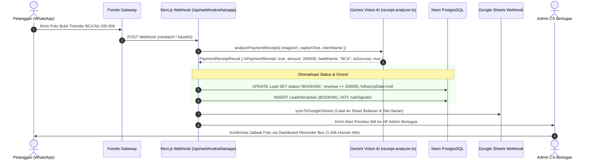

# Foxe Studio — Vision AI Receipt OCR & Auto-Conversion

Status: #active #foxe-studio #vision-ai #ocr #booking-conversion
Tanggal Terakhir Diperbarui: 23 September 2026
Terkait: [[Foxe Studio - AI CRM & Automation Memory]], [[Foxe Studio - Parser Specs & Data Pipeline]], [[Foxe Studio - KPI & Conversion System]]

---

## 1. Latar Belakang & Alasan Bisnis

Pada operasional harian Foxe Studio, pelanggan yang telah sepakat memilih jadwal sesi foto biasanya mengirimkan **foto tangkapan layar (screenshot) bukti transfer uang muka (DP) atau pelunasan** melalui WhatsApp.

Sebelum adanya modul ini:
- CS harus membaca manual nominal di layar HP.
- Sering terjadi kelalaian mencatat status pemesanan di spreadsheet.
- Reminder follow-up terus berjalan meskipun pelanggan sebenarnya sudah membayar.

Dengan **Gemini Multimodal Vision AI OCR**:
- Foto struk yang masuk ke WhatsApp otomatis dibaca dalam waktu ~2 detik.
- Sistem mengekstrak nominal rupiah, nama bank, status transaksi, dan nomor referensi.
- Status prospek langsung berubah menjadi **`BOOKING` (Konversi Sah)**, antrean follow-up dimatikan, dan omzet terakumulasi.

---

## 2. Alur Kerja Verifikasi Visual (Step-by-Step)



---

## 3. Bank & Dompet Digital yang Didukung

Parser Vision AI telah dikalibrasi untuk mengenali format visual dari seluruh institusi perbankan utama di Indonesia:

1. **Bank Konvensional & Syariah:**
   - **BCA:** BCA Mobile (m-BCA, myBCA, KlikBCA)
   - **Bank Mandiri:** Livin' by Mandiri (Struk biru/kuning)
   - **Bank Rakyat Indonesia (BRI):** BRImo
   - **Bank Negara Indonesia (BNI):** BNI Mobile Banking / Wondr by BNI
   - **Bank Syariah Indonesia (BSI):** BSI Mobile
   - **CIMB Niaga:** OCTO Mobile
2. **Bank Digital:**
   - **SeaBank** (Shopee)
   - **Bank Jago**
   - **Allo Bank** / **Blu by BCA Digital**
3. **Dompet Digital (E-Wallet) & QRIS:**
   - **QRIS:** Seluruh struk pembayaran scan QRIS nasional
   - **GoPay**, **OVO**, **DANA**, **ShopeePay**

---

## 4. Parameter Ekstraksi & Skema JSON

Gemini Vision AI menggunakan prompt instruksi yang ketat (*Strict Output*) dengan skema berikut:

```typescript
export interface PaymentReceiptResult {
  isPaymentReceipt: boolean;           // Apakah gambar merupakan struk sah?
  bankName: string;                    // Nama bank penerbit (misal: "BCA", "Mandiri", "QRIS")
  amount: number;                      // Nominal bulat angka rupiah (contoh: 200000, bukan string "Rp 200.000")
  senderName: string;                  // Nama pemilik rekening pengirim
  recipientName: string;               // Nama rekening tujuan (Foxe Studio)
  transactionDate: string;             // Tanggal & waktu transaksi pada struk
  isSuccess: boolean;                  // True jika berstatus "Berhasil" / "Sukses" (bukan "Pending" / "Gagal")
  referenceNumber: string;             // Nomor referensi transaksi bank
  summary: string;                     // 1 kalimat kesimpulan verifikasi AI
  confidenceScore: number;             // Skor keyakinan 0.0 s.d 1.0 (ambang batas valid: >= 0.70)
  suggestedConfirmationReply: string;  // Draf ucapan terima kasih & konfirmasi booking resmi untuk CS
}
```

---

## 5. Dampak Otomatisasi pada Basis Data (Database Mutations)

Ketika fungsi `analyzePaymentReceipt` mengembalikan `isPaymentReceipt === true` dan `isSuccess === true`, sistem mengeksekusi mutasi berikut:

### A. Tabel `Lead`
- **`status`** diubah menjadi `"BOOKING"`.
- **`hasBooking`** diubah menjadi `true`.
- **`lastBookingDate`** diisi timestamp waktu verifikasi.
- **`revenue`** ditambah sejumlah `amount` hasil ekstraksi OCR.
- **`leadScore`** diset ke maksimum `100` dengan temperatur `"HOT"`.
- **`closingAdmin`** dicatat sesuai Admin Shift yang sedang bertugas saat struk diterima (`Admin 1` atau `Admin 2`).
- **`followUpDate = null`**: **Antrean follow up otomatis dimatikan** agar klien yang sudah bayar tidak di-follow up lagi secara canggung.

### B. Tabel `LeadInteraction`
- Mencatat log interaksi dengan kategori intent `"BOOKING"`.
- Rule signals terisi: `PAYMENT_RECEIPT_VERIFIED, [Nama Bank], NOMINAL_[Nominal], CS_[Admin]`.
- Status follow-up diset `"COMPLETED"` dan `isHighPriority = true`.

### C. Draf Balasan Konfirmasi CS (Dengan Tanda Tangan Shift)
Draf otomatis dihasilkan dengan hashtag shift yang aktif:
```
Halo Kak! Pembayaran transfer sebesar Rp 200.000 via BCA sudah kami terima dengan baik. Jadwal sesi foto kakak resmi TERKONFIRMASI! Sampai jumpa di Foxe Studio ya kak 📸✨

—
Salam hangat, Foxe Studio
#Admin1
```

---

## 6. Notifikasi Alert Prioritas WhatsApp Admin

Sistem langsung mengirimkan notifikasi internal ke nomor WhatsApp HP admin operasional yang sedang jaga:

```text
🎉 *[PEMBAYARAN DP/LUNAS TERVERIFIKASI - FOXE STUDIO]*
Pelanggan baru saja mengirim bukti transfer sah!

👤 *Customer:* Siti Rahma (628123456789)
🏦 *Bank:* BCA
💰 *Nominal:* Rp 200.000
📋 *Nama di Struk:* SITI RAHMAWATI
🔖 *No. Ref:* 2026092309182391
📅 *Waktu Transaksi:* 23 Sep 2026 13:45 WIB
🎯 *Status:* BOOKING (Konversi Sah)
👨‍💼 *Petugas Shift:* Admin 1

Buka Dashboard CRM untuk review jadwal:
https://foxe-studio-id.vercel.app/crm
```
