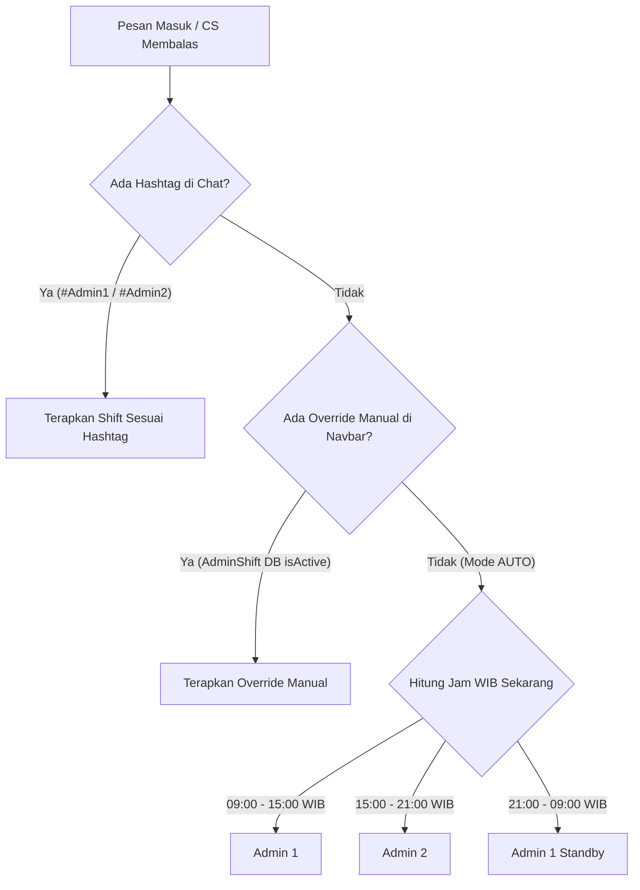

# Foxe Studio — WhatsApp Webhook & Shift System

Status: #active #foxe-studio #whatsapp #admin-shift #customer-service
Tanggal Terakhir Diperbarui: 23 September 2026
Terkait: [[Foxe Studio - AI CRM & Automation Memory]], [[Foxe Studio - Parser Specs & Data Pipeline]], [[Foxe Studio - KPI & Conversion System]]

---

## 1. Latar Belakang & Aturan Penamaan Shift

Customer Service (CS) di Foxe Studio dikelola oleh staf berstatus mahasiswa yang memiliki jadwal kuliah dinamis dan fleksibel. 

> [!IMPORTANT]
> **Kebijakan Penamaan Akun Prototype:**
> Dalam tahap sistem prototype ini, identitas staf CS distandarkan menggunakan penamaan formal netral: **Admin 1** dan **Admin 2**, tanpa menggunakan nama pribadi agar sistem mudah direplikasi dan dievaluasi.

### Pembagian Jam Kerja Shift Operasional (WIB):
- **Shift 1 (Pagi / Siang):** `09:00 - 15:00 WIB` $\rightarrow$ **Admin 1**
- **Shift 2 (Sore / Malam):** `15:00 - 21:00 WIB` $\rightarrow$ **Admin 2**
- **Off-Hours / Siaga Malam:** `21:00 - 09:00 WIB` $\rightarrow$ Default standby ke Admin 1.

---

## 2. Fleksibilitas Pertukaran Shift (Mahasiswa Friendly)

Karena kesibukan jadwal kuliah, CS dapat berganti giliran jaga kapan saja menggunakan **dua mekanisme cerdas**:



### Mekanisme 1: Dropdown Switcher di Topbar Navbar
- Terletak di pojok kanan atas seluruh halaman aplikasi (`AdminShiftDropdown.tsx`).
- CS cukup mengklik tombol pil shift untuk memilih:
  - 🔄 **Otomatis (Sesuai Jam Operasional)**
  - ☀️ **Admin 1 (09:00 - 15:00)**
  - 🌙 **Admin 2 (15:00 - 21:00)**
- Pilihan ini tersimpan di tabel `AdminShift` pada database Neon PostgreSQL dan langsung aktif seketika tanpa perlu restart server.

### Mekanisme 2: Deteksi Hashtag di Footer Pesan Chat (`#Admin1` / `#Admin2`)
- Jika admin membalas pelanggan melalui HP langsung di WhatsApp Web / aplikasi WhatsApp, sistem memeriksa apakah terdapat hashtag tanda tangan di baris paling bawah.
- Regex parser mendeteksi variasi:
  - `#Admin1`, `#admin1`, `#Admin 1`, `#Amel` $\rightarrow$ Dipetakan ke **Admin 1**
  - `#Admin2`, `#admin2`, `#Admin 2`, `#Indah` $\rightarrow$ Dipetakan ke **Admin 2**

---

## 3. Format Tanda Tangan Footer Otomatis (`formatCsReplyWithSignature`)

Setiap draf balasan yang diusulkan oleh AI atau dikirimkan melalui tombol dashboard secara otomatis dibubuhi salam penutup dan tanda tangan resmi:

```typescript
export function formatCsReplyWithSignature(reply: string, adminName: string): string {
  const cleanReply = reply.trim();
  const tag = adminName.includes("2") ? "#Admin2" : "#Admin1";

  // Mencegah duplikasi jika hashtag sudah ada
  if (/#(admin\s*1|admin\s*2|amel|indah)/i.test(cleanReply)) {
    return cleanReply;
  }

  return `${cleanReply}\n\n—\nSalam hangat, Foxe Studio\n${tag}`;
}
```

### Contoh Hasil Balasan:
> Halo Kak Siti! Paket Graduation Premium kami sudah termasuk 5 cetak foto frame 4R dan soft file Google Drive. Ada slot kosong di hari Sabtu jam 14.00, mau kami amankan kak?
> 
> —
> Salam hangat, Foxe Studio
> #Admin1

---

## 4. Filosofi Human-in-the-Loop (Anti-Robot)

> [!WARNING]
> **Larangan Pengiriman Pesan Otomatis (Autonomous Sending Ban):**
> AI **DILARANG KERAS** mengirimkan pesan WhatsApp ke pelanggan tanpa persetujuan manual staf CS.

### Alasan Filosofis:
1. **Mencegah Halusinasi Jadwal:** AI tidak boleh menjanjikan jam slot foto yang ternyata sedang proses pembersihan studio atau kendala teknis kamera.
2. **Kenyamanan Pelanggan:** Interaksi di industri jasa foto studio sangat mengutamakan kehangatan manusiawi (*human touch*).
3. **Penyaringan Komplain:** Komplain dari pelanggan harus ditangani secara empatik oleh manusia, dengan AI hanya memberikan rekomendasi solusi terbaik.

### Alur Kerja CS Sehari-hari:
1. CS membuka halaman `/crm` atau `/dashboard`.
2. Kotak **CS Reminder Box** menampilkan pesan yang belum terbalas atau bukti bayar yang baru masuk.
3. CS membaca draf balasan yang telah disiapkan AI.
4. CS dapat mengedit teks jika diperlukan, lalu menekan tombol **"Kirim WA (Human)"**.
5. Browser akan membuka WhatsApp Web / aplikasi WhatsApp dengan pesan yang sudah terisi rapi, siap ditekan tombol kirim.

---

## 5. Konfigurasi Webhook Fonnte Gateway

| Parameter | Nilai Resmi |
| :--- | :--- |
| **Penyedia Gateway** | Fonnte (`https://md.fonnte.com/`) |
| **Nomor HP Bisnis** | `6285189210021` |
| **Device Token** | `PDJCeNj6vDmKjSy9ZfvU` |
| **Webhook URL Target** | `https://foxe-studio-id.vercel.app/api/webhook/whatsapp` |
| **Metode HTTP** | `POST` (Format JSON) |

### Langkah Setting Webhook di Dashboard Fonnte:
1. Login ke [https://md.fonnte.com/](https://md.fonnte.com/).
2. Pilih menu **Device** $\rightarrow$ klik tombol **Edit** (icon pensil).
3. Isi kolom **Webhook** dengan URL: `https://foxe-studio-id.vercel.app/api/webhook/whatsapp`.
4. Centang status aktif dan klik **Save**.
